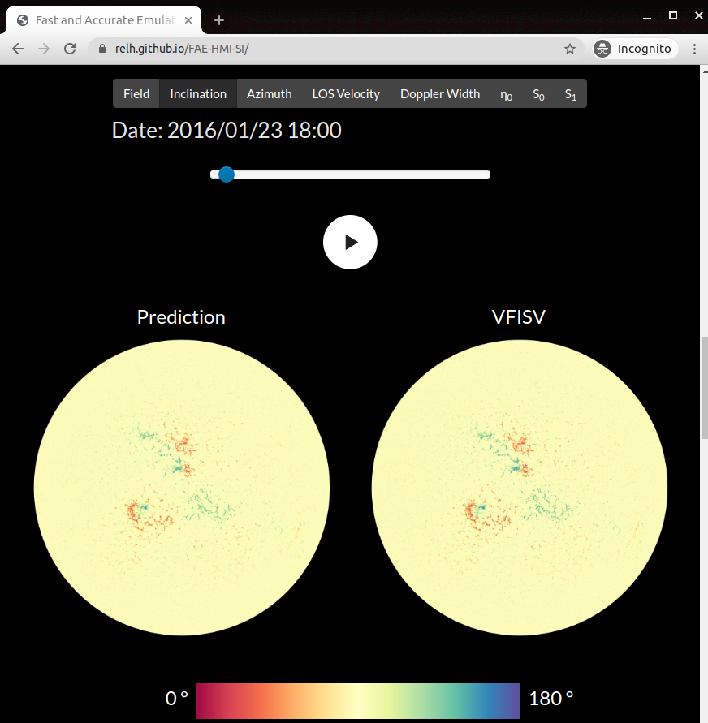
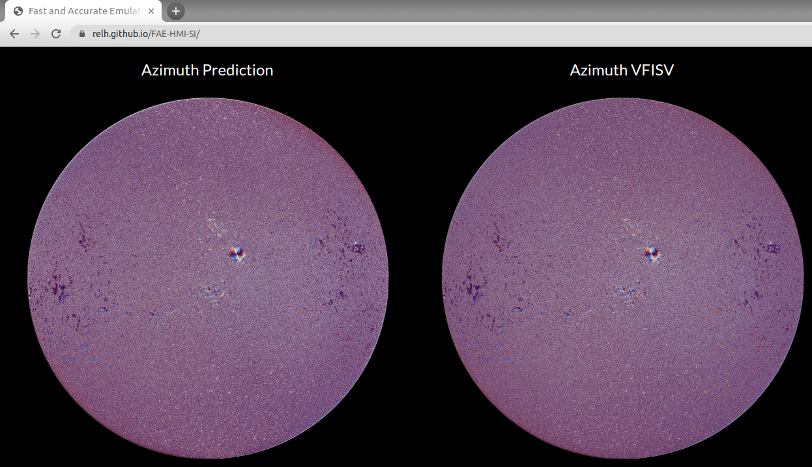

# FAE-HMI-SI
## Fast and Accurate Emulation of the SDO/HMI Stokes Inversion with Uncertainty Quantification

Welcome to FAE-HMI-SI! 

This is code for the paper [Fast and Accurate Emulation of the SDO/HMI Stokes Inversion with Uncertainty Quantification](https://arxiv.org/abs/2103.17273), 
accepted for publication in the [Astrophysical Journal](https://iopscience.iop.org/journal/0004-637X).

We train a UNet to map a 28-dimensional signal of polarized light (4 polarizations at 6 bandpasses + metadata) into a magnetic field vector,
representing the strength and direction of the magnetic field on the surface of the sun.

To learn more, watch my [talk at the COSPAR2021 Workshop on ML for Space Sciences](https://www.youtube.com/watch?v=cEKR05TyDjg&list=PLJ6DM-dKMZKe1espIcO89lfO0ABtIaLMG&index=14),
see our [poster at the AGU 2020 ML in Space Weather session](https://agu.confex.com/agu/fm20/meetingapp.cgi/Paper/684287), 
or **checkout the [interactive project website](https://relh.github.io/FAE-HMI-SI/):**

<p align="center">

</p>

## Installation 

Install [pytorch](pytorch.org) for use on a GPU, then install the remaining requirements:

```
conda install pytorch torchvision torchaudio cudatoolkit=10.2 -c pytorch
pip install -r requirements.txt
```

## Download Pre-trained Models 

To use pre-trained models, first download them (1.2 GB) from dropbox.
You can either download the full models that use 28-dimensional input, or models that were trained with IQUVs+Continuum on unrotated input:

```
wget https://www.dropbox.com/s/x4lrx2npy4zv403/models.zip
unzip models.zip

wget https://www.dropbox.com/s/fseqojcw7pkupn5/models_norotate.zip
unzip models_norotate.zip
```

## Inference

Once you have models downloaded/trained, fetch an example `(28, 4096, 4096)` input tensor (1.8 GB):

```
wget https://www.dropbox.com/s/3itmkqcal4u0otl/inputs.zip
unzip inputs.zip
```

Then run `python inference.py` and check the `outputs/` folder.

## Training

Alternatively, you can download ZARRs that contain the full year-long dataset (250+ GB each) and then train models and run inference yourself:

```
wget https://www.dropbox.com/s/mhfta8mqqtni8fi/HMI2015_ZARR.tar
wget https://www.dropbox.com/s/417a3y9zmz1svy7/HMI2016_ZARR.tar
tar -xvf HMI2015_ZARR.tar
tar -xvf HMI2016_ZARR.tar
```

Then run `python train.py`, wait ~1 day or so, and then find your new model in `models/`.
Once trained, you need to change `inference.py` so that the `saved_network_state` points to your new model..
After running `python inference.py`, check the `outputs/` folder!

## Reminder 

Remember, the [project website](https://relh.github.io/FAE-HMI-SI/) has detailed explanations and demos:

<p align="center">

</p>

## Acknowledgements

This work was supported by a NASA Heliophysics DRIVE Science Center (SOLSTICE) at the University of Michigan under grant NASA 80NSSC20K0600 and a Michigan Institute for Data Science Propelling Original Data Science grant.  GB and KDL also acknowledge NASA/GSFC grant 80NSSC19K0317.  All data used in this study are available from the Joint Science Operations Center (JSOC) at Stanford University, see http://jsoc.stanford.edu/.

Credit to [Pytorch-UNet](https://github.com/milesial/Pytorch-UNet) for the great pytorch unet implementation!

Credit to [js-image-zoom](https://github.com/malaman/js-image-zoom) for the great image zoom tool on the project website.

<br>


